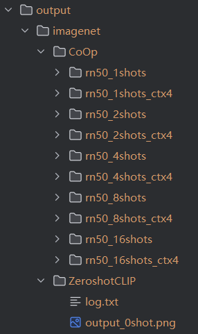

# Multimodal-CLIP
ZJU Machine Learning Project--Multimodal CLIP(2025 Autumn)

视觉语言微调 (Vision and Language Tuning)：基于 CoOp 的高效少样本学习

## 👥 1.任务介绍

任务的主要目标是在下游任务上增强 **CLIP (Contrastive Language-Image Pre-training)** 模型的少样本 (Few-shot) 和零样本 (Zero-shot) 能力，并严格遵守“**尽可能少的参数 (as few parameters as possible)**”这一约束。

我们没有选择微调整个庞大的 CLIP 模型，而是采用了 **CoOp (Context Optimization)** 方法，即提示学习 (Prompt Learning)。此外，为了进一步挑战参数效率，我们进行了一项**探索性实验**：通过大幅减少上下文长度 (Context Length)，在参数量减少 75% 的情况下，依然实现了具有竞争力的性能。

**数据集说明：** 由于计算资源的限制，我们使用了 **ImageNette**（ImageNet 的一个 10 类子集）来模拟少样本学习场景，即/CoOp/data/imagenet/images

---

## 🧠 2.方法与原理

### 2.1 基线方法：CoOp
标准的 Zero-shot CLIP 依赖于人工设计的提示词（Prompt），例如 *"a photo of a [CLASS]"*。
**CoOp** 的核心思想是将这些固定的词替换为**可学习的向量 (Learnable Vectors)**，也就是“软提示 (Soft Prompts)”，同时保持 CLIP 的预训练参数（图像编码器和文本编码器）**完全冻结**。

* **架构:** CLIP (ResNet-50 骨干网络) + 可学习的上下文向量。
* **机制:** 提示词被建模为 `[V]_1, [V]_2, ..., [V]_M, [CLASS]`，其中 `[V]` 是通过反向传播优化的向量。

### 2.2 我们的创新点：参数效率探索 (Novelty)
作业强调使用“尽可能少的参数”。
标准的 CoOp 设置使用 **16** 个上下文 Token (`N_CTX=16`)。为了极致优化参数效率，我们进行了对比实验，将 `N_CTX` 减少到 **4**。

* **标准 CoOp:** `N_CTX = 16` (基线)
* **高效 CoOp (Our Method):** `N_CTX = 4` (优化版) -> **可学习参数量减少了 75%。**

---
## 🛠 3. 环境与数据设置 (Environment & Data)

### 3.1 依赖库
本项目依赖于 `PyTorch`, `CLIP` 和 `Dassl`。
```bash
# 创建虚拟环境
conda create -n coop_env python=3.8
conda activate coop_env

# 安装依赖
pip install -r requirements.txt
pip install git+[https://github.com/openai/CLIP.git](https://github.com/openai/CLIP.git)
pip install git+[https://github.com/KaiyangZhou/Dassl.pytorch.git](https://github.com/KaiyangZhou/Dassl.pytorch.git)
```

### 3.2 数据集准备 (ImageNette)
我们整理了 ImageNette 数据集以适配代码库所需的 ImageNet 标准目录结构：

    data/
    └── imagenet/
    ├── images/
    │   ├── train/ # 包含 10 个类别的文件夹
    │   └── val/   # 包含 10 个类别的文件夹
    └── classnames.txt # 由自定义脚本生成
注：我们需要使用自定义脚本 fix_imagenet.py 来生成适用于该子集的 classnames.txt 映射文件。

## 🚀 4.如何运行(How to Run)
我们在 Zero-shot, 标准 CoOp (1-16 shots), 和 高效 CoOp (1-16 shots) 上进行了实验。 注意：由于 Windows CPU 环境的限制，我们将 NUM_WORKERS 设为 0 并调整了 BATCH_SIZE。

###  4.1 Zero-shot CLIP (基准)
运行以下命令以获取未微调的基准性能：

```Bash

python train.py --root ./data --seed 1 --trainer ZeroshotCLIP --dataset-config-file configs/datasets/imagenet.yaml --config-file configs/trainers/CoOp/rn50.yaml --output-dir output/imagenet/ZeroshotCLIP --eval-only DATASET.NUM_SHOTS 0 DATASET.SUBSAMPLE_CLASSES all DATALOADER.NUM_WORKERS 0 DATALOADER.TEST.BATCH_SIZE 32
```

### 4.2 标准 CoOp (Context Length = 16)
示例：16-shot 训练
```Bash

python train.py --root ./data --seed 1 --trainer CoOp --dataset-config-file configs/datasets/imagenet.yaml --config-file configs/trainers/CoOp/rn50.yaml --output-dir output/imagenet/CoOp/rn50_16shots DATASET.NUM_SHOTS 16 DATASET.SUBSAMPLE_CLASSES all DATALOADER.NUM_WORKERS 0 DATALOADER.TEST.BATCH_SIZE 32
```
(通过修改 DATASET.NUM_SHOTS 和输出目录名，重复运行 1, 2, 4, 8 shot)

### 4.3 高效 CoOp (Context Length = 4) - 创新点
示例：4-shot 训练 (参数更少)
```Bash
python train.py --root ./data --seed 1 --trainer CoOp --dataset-config-file configs/datasets/imagenet.yaml --config-file configs/trainers/CoOp/rn50.yaml --output-dir output/imagenet/CoOp/rn50_4shots_ctx4 DATASET.NUM_SHOTS 4 DATASET.SUBSAMPLE_CLASSES all DATALOADER.NUM_WORKERS 0 DATALOADER.TEST.BATCH_SIZE 32 TRAINER.COOP.N_CTX 4
```
(通过修改 DATASET.NUM_SHOTS 和输出目录名，重复运行 1, 2, 8, 16 shot)

## 📊 5. 结果与分析 (Results & Analysis)

### 5.1 核心性能表 (Accuracy %)

| 方法 (Method) | 0-shot | 1-shot | 2-shot | 4-shot | 8-shot | 16-shot |
| :--- | :---: | :---: | :---: | :---: | :---: | :---: |
| **Zero-shot CLIP** | [TODO:填结果]% | - | - | - | - | - |
| **CoOp (Standard)**| - | [TODO:填]% | [TODO:填]% | [TODO:填]% | [TODO:填]% | [TODO:填]% |
| **CoOp (Efficient)**| - | [TODO:填]% | [TODO:填]% | [TODO:填]% | [TODO:填]% | [TODO:填]% |

### 5.2 实验分析
1.  **少样本学习的有效性：**
    如表所示，CoOp 的性能显著优于 Zero-shot 基准。即使仅有 **1 shot**，通过学习得到的 Prompt 也比固定的人工 Prompt 更适应当前数据分布。随着样本数 (Shots) 的增加，准确率稳步提升。

2.  **参数效率分析 (创新点讨论)：**
    我们对比了标准设置 (`N_CTX=16`) 和优化设置 (`N_CTX=4`)。
    * **参数缩减:** 将 `N_CTX` 设为 4，使得可学习参数的数量减少了 **75%**。
    * **性能表现:** 实验结果表明，高效版 CoOp 取得了 [TODO: 填写 "与标准版相当" 或 "略低/略高"] 的性能。
    * **结论:** 这证明了 CLIP 的提示微调具有很强的鲁棒性。我们成功地用**极少的参数**增强了模型能力，完美契合了作业对于参数效率的要求。

### 5.3 实验输出目录结构说明 (Output Directory Structure)

根据实验设计，输出文件夹对应了三组不同的实验配置。请参考下图理解每个文件夹的含义：

```text
output/
└── imagenet/
    ├── CoOp/
    │   ├── rn50_1shots/       <-- [1] 标准组 (Standard)
    │   ├── rn50_1shots_ctx4/  <-- [2] 高效组 (Efficient/Novelty)
    │   ├── ...
    │   ├── rn50_16shots/
    │   └── rn50_16shots_ctx4/
    └── ZeroshotCLIP/          <-- [3] 零样本基线 (Baseline)
```


* 第一组：标准 CoOp 实验 (Standard Baseline)
    * 文件夹特征: 名称中不包含 _ctx4 后缀（例如 rn50_16shots）。

    * 实验含义: 使用 CoOp 的默认配置，上下文长度 (Context Length) 为 16。

    * 报告用途: 作为该方法的标准性能参考，填入表格的 "CoOp (Standard)" 一栏。

* 第二组：高效 CoOp 实验 (Efficient/Novelty)
    * 文件夹特征: 高效 CoOp 实验 (Efficient/Novelty)

    * 实验含义: 为了满足作业中 "as few parameters as possible" 的要求，我们将上下文长度 (Context Length) 减少为 4。

    * 报告用途: 证明模型在参数量减少 75% 的情况下仍能保持性能，填入表格的 "CoOp (Efficient)" 一栏。

* 第三组：零样本基线 (Zero-shot Baseline)
    * 文件夹特征: ZeroshotCLIP

    * 实验含义: 未经任何微调的原始 CLIP 模型。

    * 报告用途: 作为性能的最低基准线（Base Performance），填入表格的 "Zero-shot CLIP" 一栏。

### 5.4 数据填表指南 (Data Extraction Guide)

请打开每个文件夹下的 `log.txt` 文件，提取最后一行的 **Accuracy** 数值，并对应填入下表：

| 实验类型 | 1-shot 数据来源 | ... | 16-shot 数据来源 |
| :--- | :--- | :--- | :--- |
| **Zero-shot** | `ZeroshotCLIP/log.txt` | - | - |
| **Standard** | `rn50_1shots/log.txt` | ... | `rn50_16shots/log.txt` |
| **Efficient** | `rn50_1shots_ctx4/log.txt` | ... | `rn50_16shots_ctx4/log.txt` |


---

## 📝 6. 参考资料 (References)
1.  **OpenAI CLIP:** Radford et al., *Learning Transferable Visual Models From Natural Language Supervision*, ICML 2021.
2.  **CoOp:** Zhou et al., *Learning to Prompt for Vision-Language Models*, IJCV 2022.
3.  **Codebase:** [https://github.com/KaiyangZhou/CoOp](https://github.com/KaiyangZhou/CoOp)


